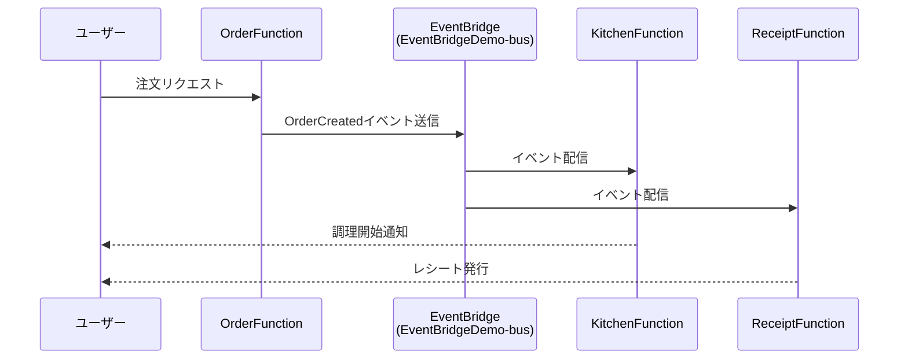

# EventBridge Demo 2025

EventBridgeを使用したイベント駆動アーキテクチャのデモンストレーション用AWS SAMアプリケーション

## アーキテクチャ概要

このアプリケーションは、レストランの注文システムをシミュレートしたイベント駆動アーキテクチャです：



## 構成要素

### Lambda関数

- **OrderFunction** (`functions/order/`)
  - 注文イベントを作成し、EventBridgeに送信
  - `EventBridgeDemo-bus`への`events:PutEvents`権限を持つ
  - 注文データ: `orderId`, `orderItem`, `quantity`, `receiptRequired`

- **KitchenFunction** (`functions/kitchen/`)
  - 注文イベントを受信して調理処理をシミュレート
  - EventBridgeルールによってトリガー

- **ReceiptFunction** (`functions/receipt/`)
  - 注文イベントを受信してレシート発行処理をシミュレート
  - EventBridgeルールによってトリガー

### EventBridge

- **カスタムイベントバス**: `EventBridgeDemo-bus`
- **イベントソース**: `demo.eventbridge.order`
- **イベントタイプ**: `OrderCreated`

## デプロイ方法

### 前提条件

- AWS CLI設定済み
- AWS SAM CLI インストール済み
- Python 3.13

### デプロイ手順

```bash
# ビルド
sam build

# デプロイ
sam deploy --guided
```

## テスト方法

### ローカルテスト

```bash
# OrderFunctionをローカルで実行
sam local invoke OrderFunction

# イベントファイルを使用してテスト
sam local invoke OrderFunction -e events/event.json
```

### 動作確認

1. OrderFunctionを実行すると注文イベントがEventBridgeに送信される
2. EventBridgeルール（別途設定が必要）によってKitchenFunctionとReceiptFunctionがトリガーされる
3. 各関数のCloudWatchログでイベント処理を確認可能

## ファイル構成

```
demo-evb-2025/
├── template.yaml           # SAMテンプレート
├── functions/
│   ├── order/             # 注文処理Lambda
│   ├── kitchen/           # 調理処理Lambda
│   └── receipt/           # レシート処理Lambda
├── events/
│   └── event.json         # テスト用イベント
└── tests/                 # テストコード
```

## 注意事項

- EventBridgeのルール設定は別途必要です
- X-Rayトレーシングが有効化されています
- 各Lambda関数のタイムアウトは10秒に設定されています

## 次のステップ

1. EventBridgeルールを作成してKitchen/ReceiptFunctionをターゲットに設定
2. CloudWatchでログとメトリクスを監視
3. X-Rayでトレースを確認してパフォーマンスを分析